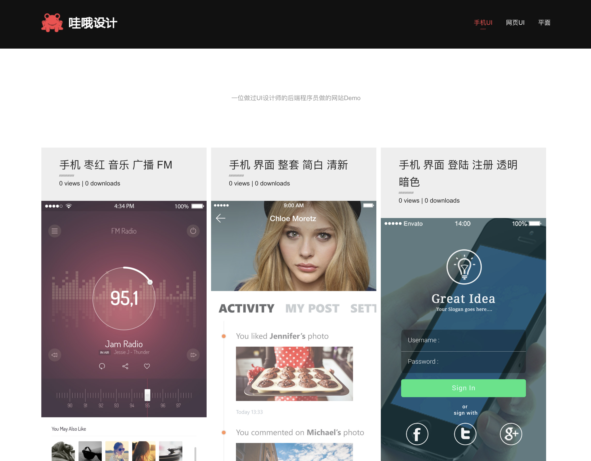
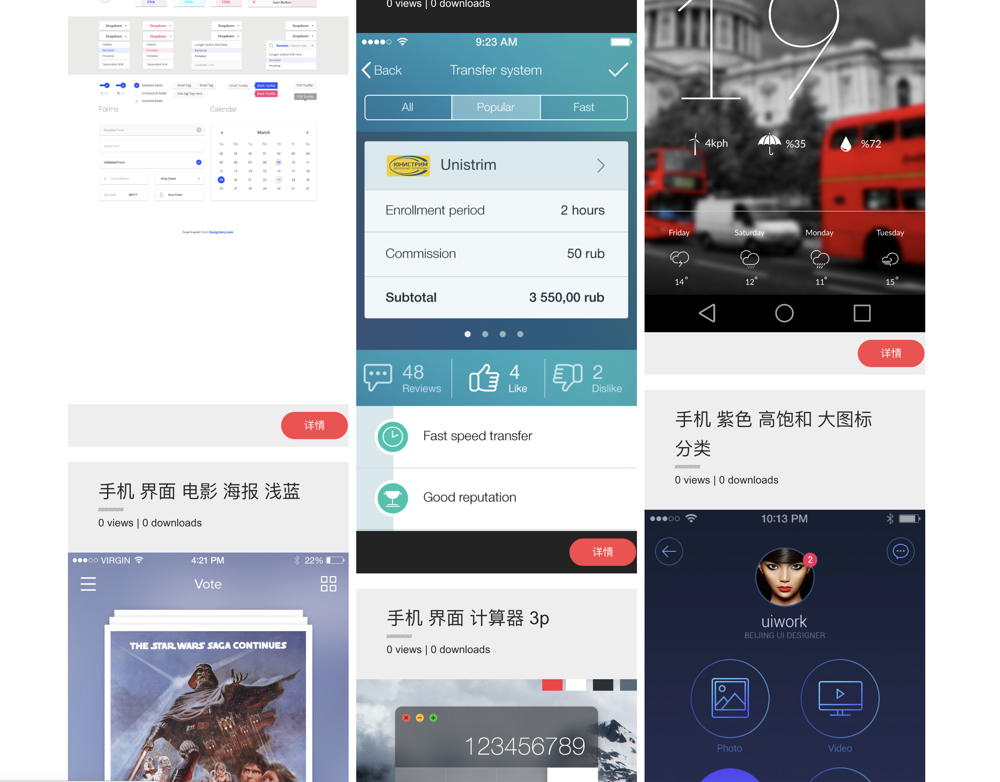

UI Material Download
===
## Brief
Status: Depreciated  
Year: 2015  
Live Demo: [live demo](https://ui_material.zyzypy.com)

Introduce:  
A Demo about UI material download website. Mainly contains mobile and web user interface works,
mainly file type is .psd(Photoshop) and .ai(Illustrator).   

It's the first website I develop from frontend to backend to deploy, after I just self-studied Python and Flask, and
resigned as a UI designer.I want to do a work relates programming and UI design, then this material download website came out.
It's a fresh project different to normal tutorial neither nor personal demo.
Commemorative to me, but technology stack is outdated and popular UI software are not Photoshop/Illustrator/Sketch for a long time.
And limited by the ability then(code duplicated and so on), So the Status is Depreciated, only used by my portfolio website.  

UI素材下载网站Demo。包含内容有手机端和网页端软件界面作品。主要格式为.psd(Photoshop)和.ai(Illustrator)。  

2015年，我刚自学学会Python（廖雪峰教程）和Flask（Flask开发实战，封面是一只素描的狗），因为做过UI设计师，所以想做一个素材下载网站。
由于技术栈和素材格式都过时了，加上当时水平不高设计的有些问题(数据库连接没有重用，代码重复多。没有使用代码生成psd缩略图，手工工作量大。
源文件与预览图片只能通过文件类型区分。图片流全加载完才显示等待较久。)，现在本项目仅用于个人纪念。

## Tech Stack
Frontend: Jinja2 Bootstrap masonry.js HTML  
Backend: Python Flask 
Storage: SevenCow OSS(v1), MySQL(v1), Sqlite(v2), local on cloud server(v2)
Deployment: deployment tool on Pycharm, gunicorn, docker(v2)

The database table is simple and OSS is a little expensive for an outdated demo, so storage choice has been simplified.
This tech stack is nostalgic, Flask with template syntax, quickly replaced by frontend-backend separation development mode.

第一版使用了七牛云对象存储和MySQL数据库，因为表结构很简单，只是一个demo，云存储有点贵，所以第二版变为Sqlite加云服务器本地存储。
Flask框架、前端Jinja模版语法渲染、Bootstrap CSS框架，是那个时代的回忆，之后迅速地被前后端分离开发模式取代。

## Screen shot

## 源文件目录维护:
<catalog>/<作品名>/【预览】封面.jpg            没有在数据库后台一一标注封面，这算是一种简单的标注。
<catalog>/<作品名>/普通图片1.jpg              作品详情页的预览图，写本项目时水平不够，当时也没找到有人做psd预览库，2020时修改此项目时发现有psd的操作库。
<catalog>/<作品名>/源文件1.psd                psd、ai、rar等源文件格式。

## License
UI files collected from Web, delete if infringement.